ROS:
- Robot Operating System
- Supports modular software design -- NODES

Notes:
- catkin init -- to initilization
- catkin build -- to build your environment

build
- contains build info
- program to machine language

logs
- reports of run exceution

devel
- running nodes (codes)

src
- warehouse of projects

Creating Packages:

Publish and Subscribe
Note: There are many default packages comes along with ros installtion.
command: rospack list

catkin_create_pkg <name>

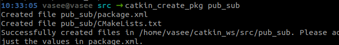

Note:
Good to have codes inside scripts

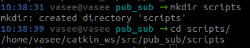

create python file (code):
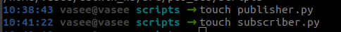

note: permission should be enabled to these newly created files

publisher file:

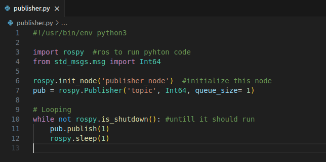

publishing topic:

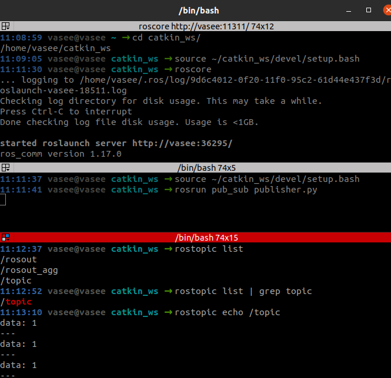

Note:
Add this to avoid sourcing again and again.

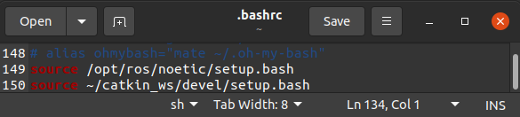

Subscriber file:

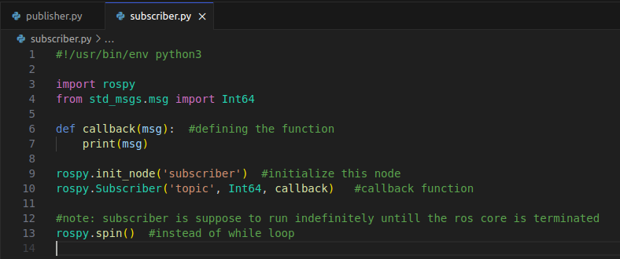

subscribing topic:

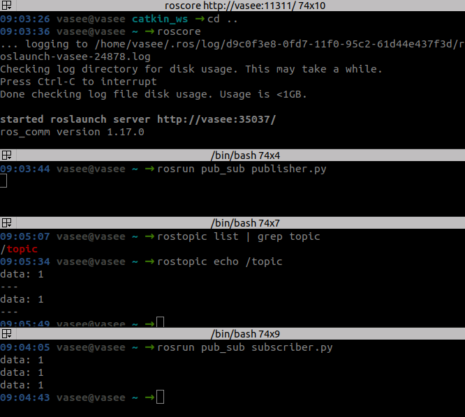

Note: If we want to delete the packages, direct deletion cannot remove
all related files inside build, devel and logs. We still need to remove
them.

Command: catkin clean --orphans

ROS LAUNCH:

Let's say we have 10 different nodes, how can we run all these nodes at
a particular time, then the ros launch came into action.

Create launch file:

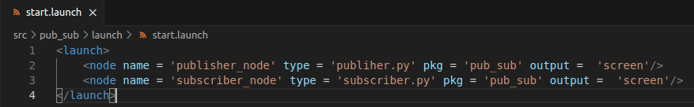

running launch file:

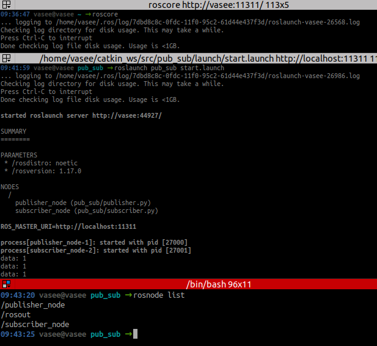

note: while running roslaunch, both publisher and subscriber nodes are
running simultaneously

we can feel this on running rosnode list and rostopic list

About RQT Tool:

command: rqt

we can examine relationship between publisher node, subscriber node and
topics.

PLAY with [Turle sim](https://wiki.ros.org/turtlesim), it is really
crazy!!
Turtle sim automatically publisher/subscribe topic (check -- rostopic
info), just we only need to create publisher/subscriber node to publish
topics accordingly.

- just to move turtle in x direction
- just check rostopic echo

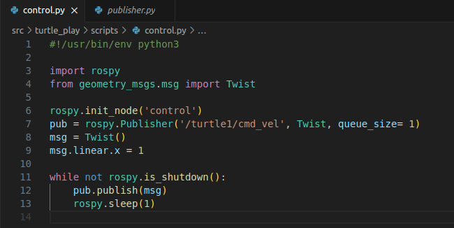

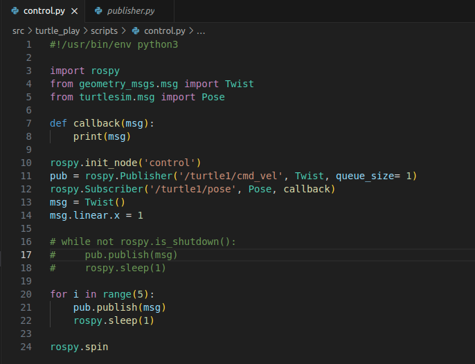

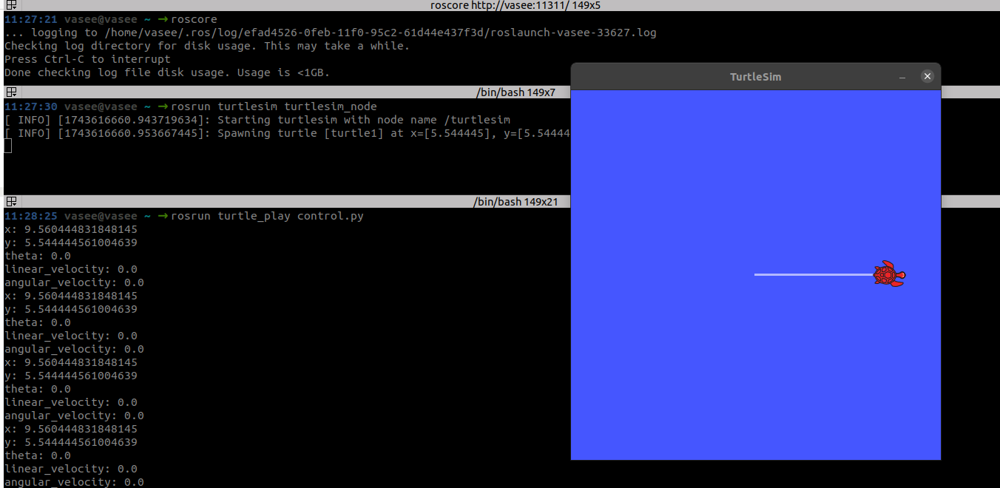

Client and Server

- client request for service from the server | server is mandatory
- request and response

creating server-client package:

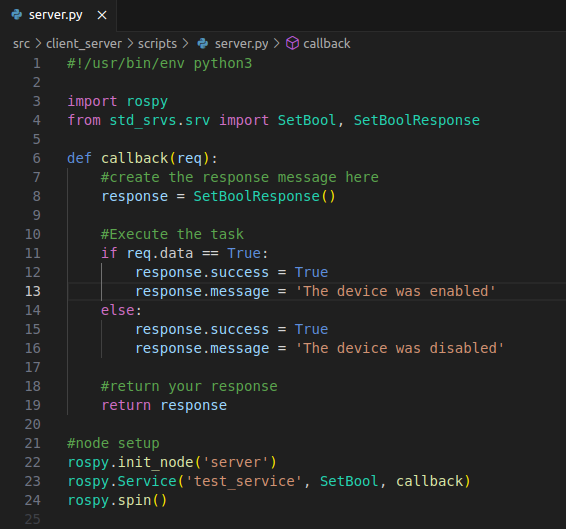

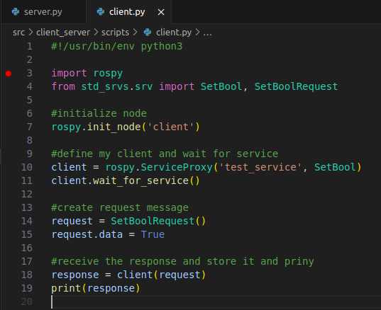

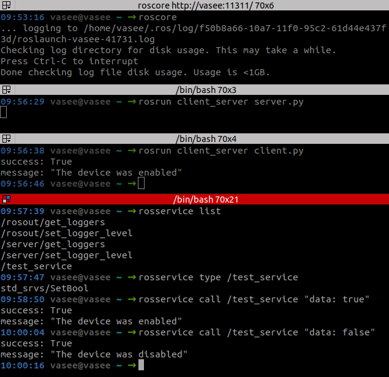

rosservice call <service_name> "date: true/false"

Note: in publish and subscribe -- there is no need for subscriber all
time

search in ros installation for service
computer/opt/ros/noetic/share/std_srvs

we can say ~ msgs are subset of services

ROS Parameter Server:
- associated with roscore
- stores parameter

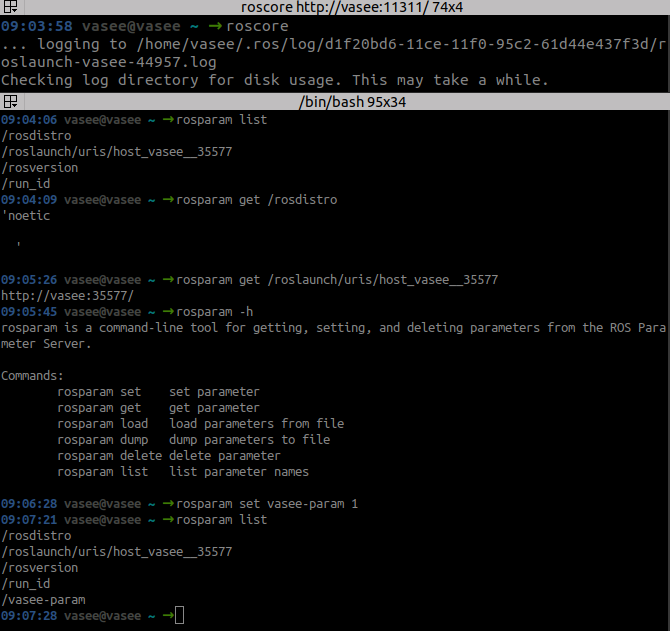

Notes:

we cannot do this everytime in terminal. We need this in some automated
scripts
we can only get this running only from roslaunch command
we need to create 'yaml' file -- basically a database

Create -- Ros Param Yaml File

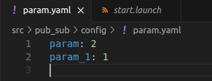

Simillary like, to run many topic at a particular time -- we use ros
launch file.
We need to include this yaml file aslo there in launch file

create -- Launch File (for param (yaml file))

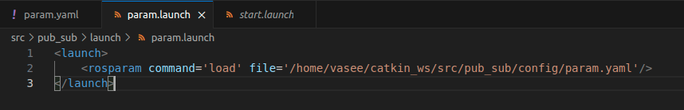

running launch file:

Here, in launch file, path of config is little tedious (not same for
everyone)

edit like this

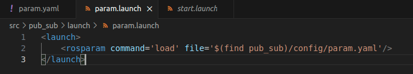

Rosbags:
Bags for storing ros-data

- run roscore
- record rosbag
- publish topic varibales

- play rosbag (where you can see traces)
- rostopic echo and look for traces

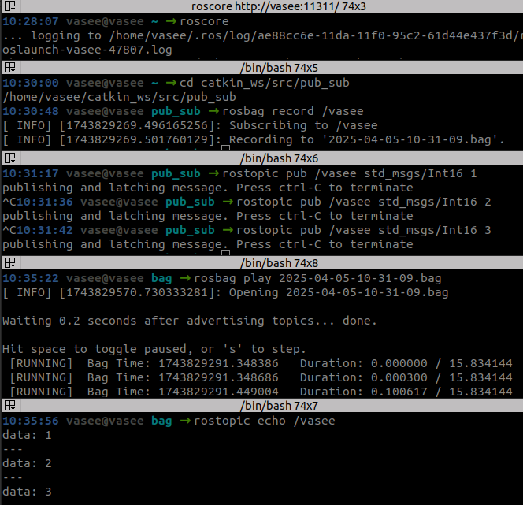

create python file to view bags contents instead of echoing

read_bag file:

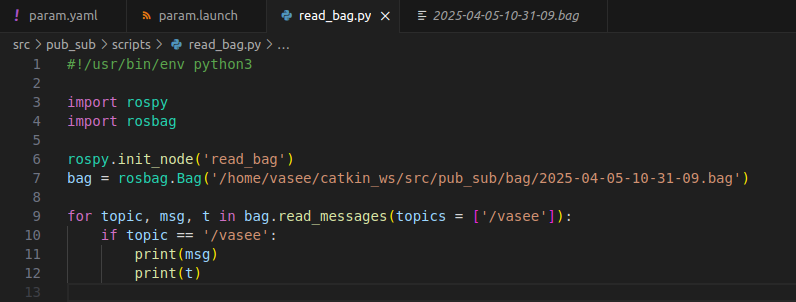

output:

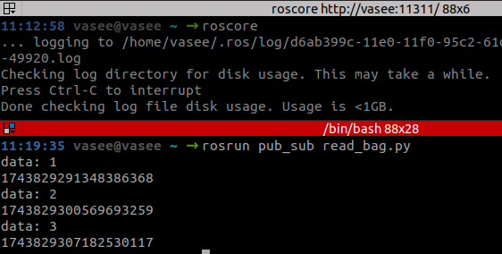

Quick Collective Works:

publisher:

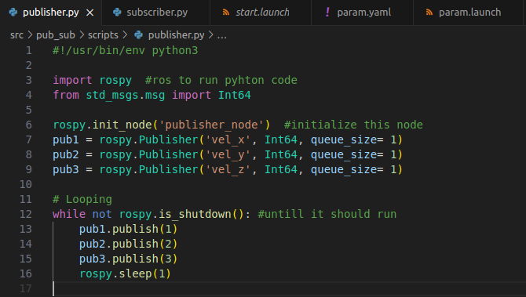

subscriber:

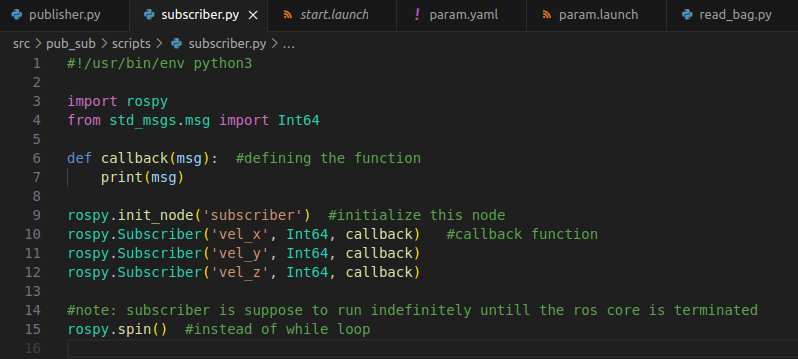

launch:

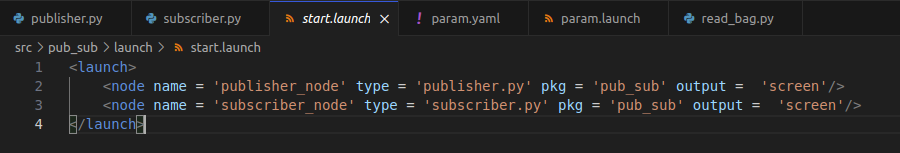

read bag:

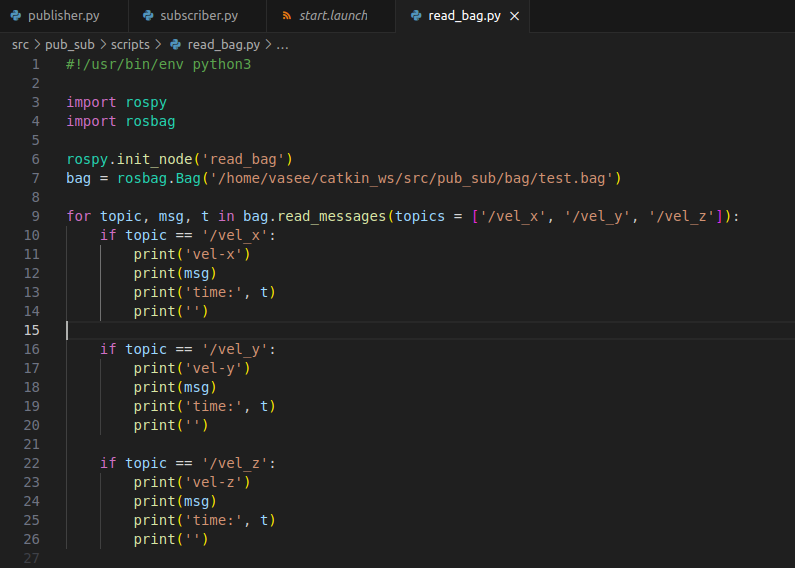

running roscore:

recording rosbags with all topics:

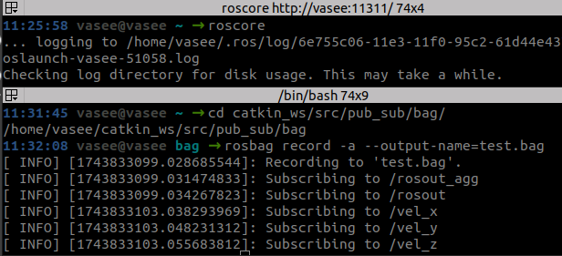

running launch file:

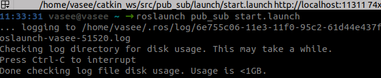

Playing rosbag:

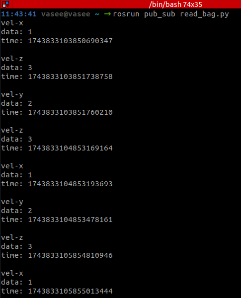
