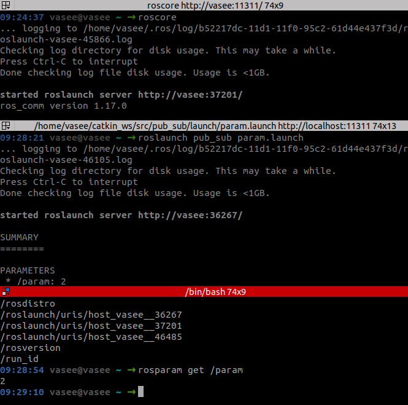

ROS:\
\
- Robot Operating System

\- Supports modular software design -- NODES

Notes:

\- catkin init -- to initilization

\- catkin build -- to build your environment

build

\- contains build info

\- program to machine language

logs

\- reports of run exceution

devel

\- running nodes (codes)

src

\- warehouse of projects

Creating Packages:

Publish and Subscribe

Note: There are many default packages comes along with ros installtion.

command: rospack list

catkin\_create\_pkg \<name\>

{width="13.795cm"
height="1.87cm"}

Note:\
Good to have codes inside scripts

{width="9.012cm"
height="1.755cm"}

create python file (code):\
{width="11.751cm"
height="1.117cm"}\

note: permission should be enabled to these newly created files

publisher file:

{width="11.164cm"
height="5.565cm"}

publishing topic:

{width="13.176cm"
height="12.76cm"}

Note:\
Add this to avoid sourcing again and again.\

{width="13.568cm"
height="2.618cm"}

Subscriber file:

{width="13.481cm"
height="5.646cm"}

subscribing topic:

{width="12.568cm"
height="11.284cm"}

Note: If we want to delete the packages, direct deletion cannot remove
all related files inside build, devel and logs. We still need to remove
them.

Command: catkin clean --orphans

ROS LAUNCH:

Let's say we have 10 different nodes, how can we run all these nodes at
a particular time, then the ros launch came into action.

Create launch file:

{width="12.282cm"
height="1.905cm"}

running launch file:

{width="15.49cm"
height="14.235cm"}

note: while running roslaunch, both publisher and subscriber nodes are
running simultaneously

we can feel this on running rosnode list and rostopic list

About RQT Tool:

command: rqt

we can examine relationship between publisher node, subscriber node and
topics.

PLAY with [Turle sim](https://wiki.ros.org/turtlesim), it is really
crazy!!\
Turtle sim automatically publisher/subscribe topic (check -- rostopic
info), just we only need to create publisher/subscriber node to publish
topics accordingly.

\- just to move turtle in x direction

\- just check rostopic echo

{width="11.321cm"
height="5.676cm"}

{width="11.405cm"
height="8.745cm"}

{width="17cm"
height="8.297cm"}

Client and Server

\- client request for service from the server \| server is mandatory

\- request and response

creating server-client package:\

{width="10.418cm"
height="9.737cm"}

{width="12.109cm"
height="9.876cm"}

{width="12.247cm"
height="11.88cm"}

rosservice call \<service\_name\> "date: true/false"

Note: in publish and subscribe -- there is no need for subscriber all
time

search in ros installation for service

computer/opt/ros/noetic/share/std\_srvs

we can say \~ msgs are subset of services

\
ROS Parameter Server:

\- associated with roscore

\- stores parameter

{width="13.57cm"
height="12.778cm"}

Notes:

we cannot do this everytime in terminal. We need this in some automated
scripts

we can only get this running only from roslaunch command

we need to create 'yaml' file -- basically a database

Create -- Ros Param Yaml File

{width="6.553cm"
height="2.522cm"}

Simillary like, to run many topic at a particular time -- we use ros
launch file.

We need to include this yaml file aslo there in launch file

create -- Launch File (for param (yaml file))

{width="15.633cm"
height="2.533cm"}

running launch file:

{width="13.376cm"
height="13.256cm"}

Here, in launch file, path of config is little tedious (not same for
everyone)

edit like this

{width="13.693cm"
height="2.45cm"}

Rosbags:\

Bags for storing ros-data

\- run roscore

\- record rosbag

\- publish topic varibales

\- play rosbag (where you can see traces)

\- rostopic echo and look for traces

{width="13.305cm"
height="12.845cm"}

create python file to view bags contents instead of echoing

read\_bag file:

{width="13.34cm"
height="5.061cm"}

output:

{width="10.716cm"
height="5.415cm"}

Quick Collective Works:\

publisher:

{width="11.718cm"
height="6.627cm"}

subscriber:

{width="14.258cm"
height="6.414cm"}

launch:

{width="17cm"
height="2.889cm"}

read bag:\
\
{width="14.575cm"
height="10.414cm"}

running roscore:

recording rosbags with all topics:\
\
{width="14.28cm"
height="6.514cm"}

running launch file:

{width="15.145cm"
height="3.117cm"}

Playing rosbag:\

{width="12.832cm"
height="15.875cm"}\
